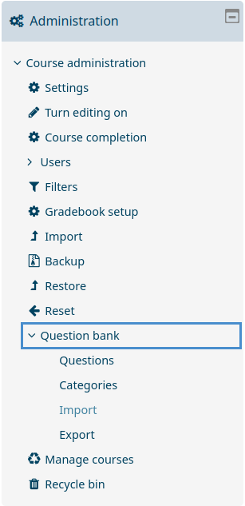
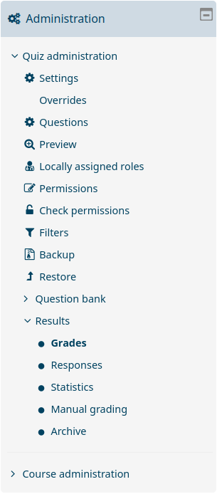

# First steps

After setting up Poodle, you can use it as a terminal command with the following arguments:

	poodle [OPTION] ... <DATABASE>
	
	Connection options:
	  -l             connects to an already running MongoDB daemon on local
	                 system or starts one manually
	  -s <ADDRESS>   connects to a server hosted at <ADDRESS> running a MongoDB
	                 daemon
	Authorization options:
	  -u <USERNAME>  username for authorization; usually only needed when
	                 connecting to server
	  -p <PASSWORD>  password for authorization; only needed when username
	                 option is provided; user will be asked for password input
					 by prompt if this option is not provided
	Miscellaneous options:
	  -h             show this help
	  
The options `-l` and `-s` are mandatory and mutually exclusive, meaning that
exactly one of them has to provided any time the `poodle` command is invoked.

We'll start by simply running `poodle -l test`. This will launch Poodle locally
and create the database `test`. When first launching a new database, you are
greeted with the following message:

	No question categories specified for database test!
	Please input list of categories you want to set for this database
	or input 0 if no predetermined categories are desired:
	
For now, you can simply input 0 and move on. You are now inside your first
database which, at this point, does not contain any questions. We'll start by
inserting the first question. 

## Creating a question

Questions in Poodle are basically JSON documents that are saved within the
MongoDB database architecture. Different question types all have their own
characteristics with some common features.[^1] Initiate the graphical user
interface of Poodle by entering the command `gtk_overview()`. You should see a
relatively empty window with some columns and a few buttons on the bottom. Press
the **New** button on the bottom left and press **OK** in the window that
opens. You can now see the template for a new multiple choice question.

Name this question *question01* and fill in all remaining fields. **question**
is the question's text that is displayed to students, **correct_answers** and
**false_answers** should be obvious, **single** (0 or 1) determines if students
can check one or more multiple answers as correct, **points** denotes the max
amount of points students can achieve for this question, **difficulty** is a
subjective difficulty ranking from 1 (very easy) to 4 (very hard), **time_est**
is the subjective estimated time for question completion in minutes,
**family_type** can be disregarded for now, just enter *single*, and
**in_exams** can not be filled at this point. You don't need to worry too much
about the exact contents of the question.

If you press the **Raw** tab on the top of the window, you can see what the
question looks like at the database level. It might look something like this:

	{
		"name": "question01",
		"question": "This is our first question. Please choose the right answer.",
		"family_type": "single",
		"moodle_type": "multichoice",
		"points": 1,
		"in_exams": {},
		"time_est": 1,
		"difficulty": 1,
		"correct_answers": [
			"Right"
		],
		"false_answers": [
			"Wrong",
			"False",
			"Incorrect"
		],
		"single": 0
	}
	
To save this question, just press **Save** on the bottom left and answer **Yes**
to the dialog that pops up. You can now close the question's window. The
overview should have updated and you should now see your question there.

## Creating an exam

There are multiple ways to create a new exam with existing questions. You can
either initiate exam creation from within the **Questions** or the **Exams**
tab. Inside the **Questions** tab, click on the **Add to exam** button to add
selected questions to the exam, and inside the **Exams** tab, simply click
**New**. Enter an exam name at the following prompt and press **OK**. The exam
creation window will now open.

On the left side you see a text in field in which question names are
entered. Whenever you press the **Add to exam** button, a selected question's
name will be added to this field, but you can also enter question names
manually. On the right side are exam metrics which can be manually updated by
pushing the **Update report** button. Once you're done with question selection,
hit **Create exam**, and the new exam will appear within the **Exams** tab.

## Importing an exam to Moodle

When an exam has been created, you will find an XML file at the path
`databases/<db-name>/exams/<new-exam-name>/` which contains an XML
representation of all questions within the exam and will be used for import into
Moodle. Once you're logged into Moodle and inside the course to which you want
to add the exam, click on **Question bank** within the administration panel and
select **Import**, as seen below.

Select the Moodle XML file format, and drag your XML file into the designated
window, afterwards press the **Import** button. Hit **Continue** on the
following screen and you will see all questions from your exam inside the
question bank. You can now use these questions as you would any which had been
created inside Moodle.[^2]

## Evaluating an exam

In order to evaluate an exam inside Poodle which has been conducted on Moodle,
you will need to select the exam inside your course. On the right side you'll
see a **Quiz administration** tab. Expand **Results** and click on
**Grades**.

Above individual student names you'll see an option to export the table data;
download it in JSON format. Afterwards, click on **Statistics** and repeat this
step.[^3]

Inside Poodle select the **Exams** tab inside the overview and click on
**Evaluate**. Select the files you just downloaded, confirm, and your exam is
now evaluated inside of Poodle.

[^1]: You can read more about question types in the chapter
    [Questions](03_questions.md).
	
[^2]: It is advised to check questions which contain any sort of formatting –
    e.g. HTML code, latex code, tables, or images – before using them.
	
[^3]: Evaluation is only supported for files downloaded with an English or
    German language profile.

[//]: # (importing from Moodle goes here in the future)
